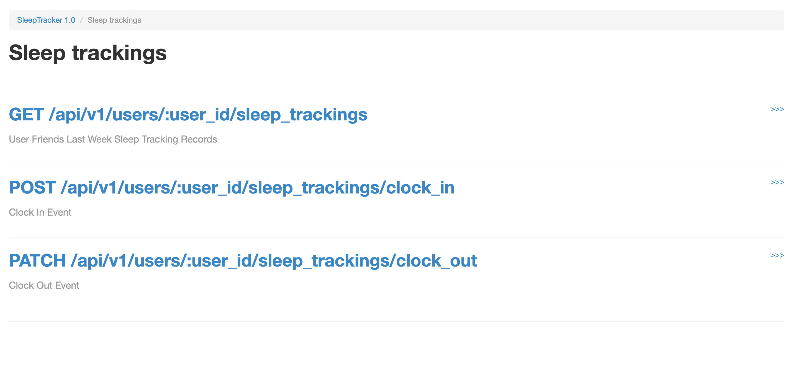
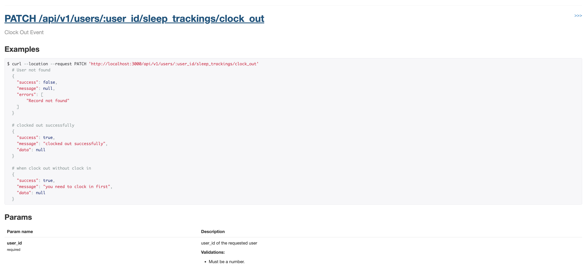

# Sleep Tracker

## Features

- User Create
- User Can Follow And Un-follow Each Other
- User Can Tracking Sleep Time (Using Clock In And Clock Out Event)
- User Can View It's Friend Sleep Time Data

## Technologies and Gems used

- Ruby on Rails (Ruby: 3.2.0, Rails: 7.0.4)
- Test Framework (Rspec)
- Factory_bot_rails
- PostgreSQL@14
- Database_cleaner (clean the database before running tests)
- shoulda-matchers (Simple one-liner tests for common Rails functionality)
- apipie-rails (for api documentation)

## DB Design

- [User](/db_design.md#user)
- [Sleep Tracking](/db_design.md#sleep-tracking)
- [User Friendship](/db_design.md#user-friendship)

### Relations
  
- User has many sleep tracking records
- User has many followers
- User has many followings

## Setup

```sh
# Clone Repository
git clone https://github.com/kananinirav/sleep_tracker.git

# Go to Folder
cd ./sleep_tracker

# Run bundle to install dependencies
bundle

# Create Database
rails db:create

# Run migration
rails db:migrate

# Finally start server
rails s

# APIs Documentations
open http://localhost:3000/apipie/

```

## Run Specs

```sh
bundle exec rspec
```

## APIs List

| No. | End Point                                            | Request Type | Description                                   |
| --- | ---------------------------------------------------- | ------------ | --------------------------------------------- |
| 1.  | /api/api/v1/users                                    | POST         | Create User                                   |
| 2.  | /api/api/v1/users/:user_id/follow/:following_id      | POST         | Follow User                                   |
| 3.  | /api/api/v1/users/:user_id/unfollow/:following_id    | DELETE       | Un-Follow User                                |
| 4.  | /api/api/v1/users/:user_id/sleep_trackings           | GET          | User Friends Last Week Sleep Tracking Records |
| 5.  | /api/api/v1/users/:user_id/sleep_trackings/clock_in  | POST         | Clock In Event                                |
| 6.  | /api/api/v1/users/:user_id/sleep_trackings/clock_out | PATCH        | Clock Out Event                               |

## APIs Documentations

For API documentations i have used `apipie-rails` gem, For more details about each APIs setup project and open `/apipie` url

### You can see screen like below with each APIs links


#### For example if you want to see sleep trackings APIs details then click on `Sleep trackings` link





#### For more details about each API click right side `>>>` link
